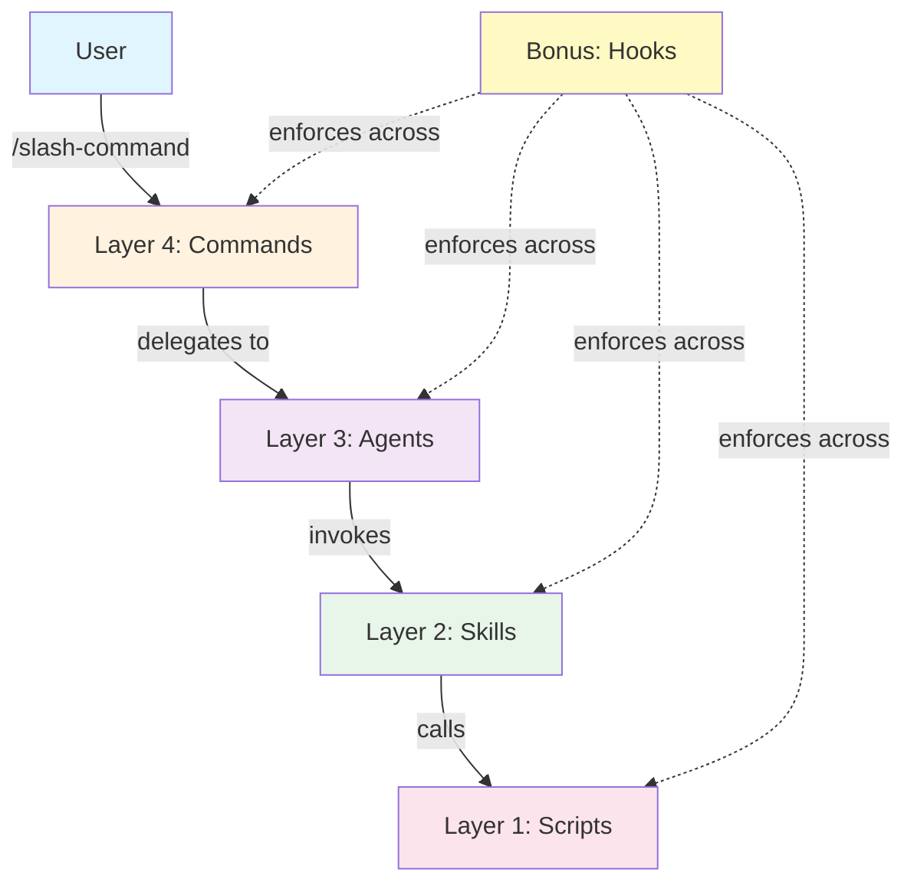
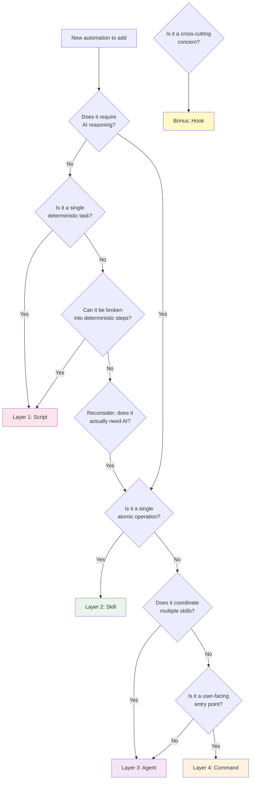

# The 4-Layer Agentic Architecture for Claude Code

## Extending Your Cognitive Horizon

Most developers use Claude Code as a flat prompt-and-respond tool. They type instructions, get output, and move on. But there is a deeper architecture waiting to be discovered -- one that transforms Claude Code from a reactive assistant into a layered autonomous system.

Understanding this architecture is not just about using tools more effectively. It is about extending your *cognitive horizon* -- the boundary of what you can conceptualize, design, and build. Each layer you internalize expands what you consider possible. You stop thinking "How do I prompt this?" and start thinking "How do I architect this?"

This document describes the **4-layer agentic architecture pattern**, a separation-of-concerns model for organizing Claude Code automation. The pattern draws inspiration from IndyDevDan's public demonstrations of Playwright-based browser automation with Claude Code, and from David Shapiro's concept of the cognitive horizon.

---

## Architecture Overview

```
+------------------------------------------------------------------+
|  Layer 4: Commands       .claude/commands/*.md                   |
|  Thin orchestration wrappers -- the user-facing /slash-commands   |
+------------------------------------------------------------------+
|  Layer 3: Agents         .claude/agents/*.md                     |
|  Workflow orchestrators with YAML frontmatter (model, tools...)  |
+------------------------------------------------------------------+
|  Layer 2: Skills         .claude/skills/*/SKILL.md               |
|  Atomic operations with optional bundled scripts                 |
+------------------------------------------------------------------+
|  Layer 1: Scripts        scripts/                                |
|  Mechanical automation -- no AI, deterministic, testable         |
+------------------------------------------------------------------+
     +  Bonus: Hooks       .claude/settings.json                   |
        Cross-cutting enforcement across all layers                |
+------------------------------------------------------------------+
```

The layers are numbered bottom-up: Layer 1 (Scripts) is the foundation; Layer 4 (Commands) is the surface. Each layer has a clear responsibility, a clear location on disk, and clear rules about what it may and may not do.

---

## Layer 1: Scripts

### What

Plain shell scripts, Python scripts, or any executable that performs **mechanical, deterministic work**. No AI reasoning. No LLM calls. Just automation.

### Where

```
scripts/
  setup.sh
  browser-install.sh
  lint-check.sh
  run-playwright.sh
```

### Why

Scripts are the bedrock of testability. They can be run independently, outside of Claude Code entirely. They can be tested in CI/CD. They can be debugged with standard tools. They give you a **deterministic foundation** that the upper layers can rely on without uncertainty.

### Design Principles

* **No AI reasoning** -- a script must never call an LLM or make decisions that require intelligence
* **Deterministic** -- given the same inputs, produce the same outputs
* **Testable standalone** -- run with `bash scripts/setup.sh` and verify the result without Claude Code
* **Single responsibility** -- one script does one thing (install browsers, run a test suite, capture a screenshot)
* **Exit codes matter** -- return 0 on success, non-zero on failure, so upper layers can react
* **Parameterized** -- accept arguments or environment variables rather than hardcoding values

### Connections to Other Layers

* Skills (Layer 2) invoke scripts as part of their atomic operations
* Agents (Layer 3) never call scripts directly -- they go through skills
* Hooks (Bonus) may invoke scripts for validation or cleanup

### Example

```bash
#!/usr/bin/env bash
# scripts/setup.sh -- Install Playwright browsers
set -euo pipefail

npx playwright install --with-deps chromium
echo "Chromium installed successfully"
```

---

## Layer 2: Skills

### What

**Atomic, reusable operations** that combine AI reasoning with deterministic scripts. A skill is a self-contained unit that knows how to accomplish one specific task. It is defined by a `SKILL.md` file with YAML frontmatter and may bundle helper scripts alongside it.

### Where

```
.claude/skills/
  playwright-browser/
    SKILL.md
    setup.sh
    capture.sh
  code-review/
    SKILL.md
  git-commit/
    SKILL.md
```

### Why

Skills are the **reuse layer**. When you find yourself repeating the same sequence of actions -- install a tool, run it, interpret the output -- that sequence becomes a skill. Skills encapsulate domain knowledge so that multiple agents can leverage the same capability without duplicating logic.

### Design Principles

* **Atomic** -- a skill does one coherent thing (capture a screenshot, run a lint pass, commit code)
* **Self-contained** -- all resources a skill needs live in its directory
* **YAML frontmatter** -- declares metadata: `name`, `description`, `allowed-tools`, and constraints (see [official skill docs](https://code.claude.com/docs/en/skills))
* **Commits own work** -- if a skill produces changes, it should commit them (not leave it for the agent)
* **Naming convention** -- `{domain}-{action}`: `playwright-browser`, `code-review`, `git-commit`
* **Bundled scripts** -- any mechanical steps live as scripts in the skill's directory, not inline in the SKILL.md

### SKILL.md Structure

```markdown
---
name: playwright-browser
description: Capture browser screenshots and run visual QA using Playwright
allowed-tools: Bash, Read, Write
---

# Playwright Browser Skill

## Setup
Run `${CLAUDE_SKILL_DIR}/scripts/setup.sh` to install Chromium via Playwright.

## Usage
1. Call `${CLAUDE_SKILL_DIR}/scripts/capture.sh <url>` to capture a screenshot
2. Read the screenshot file to perform visual analysis
3. Report findings in structured format

## Constraints
* Always install browsers before first use
* Clean up screenshot files after analysis
* Never navigate to URLs not provided by the caller
```

> **Note:** `allowed-tools` uses hyphens (not underscores). `${CLAUDE_SKILL_DIR}` resolves to the skill's directory at runtime.
> See [official skill docs](https://code.claude.com/docs/en/skills) for all frontmatter fields.

### Connections to Other Layers

* Scripts (Layer 1) provide the mechanical steps that skills orchestrate
* Agents (Layer 3) invoke skills as building blocks in their workflows
* Commands (Layer 4) never call skills directly -- they delegate to agents

---

## Layer 3: Agents

### What

**Workflow orchestrators** that coordinate multiple skills to accomplish complex, multi-step goals. An agent has a persona, a strategy, and the authority to make decisions about how to sequence its work. Agents are defined in `.md` files with YAML frontmatter specifying model, allowed tools, and behavioral constraints.

### Where

```
.claude/agents/
  browser-qa.md
  code-reviewer.md
  research-analyst.md
```

### Why

Agents are where **judgment lives**. A script cannot decide whether a UI looks broken. A skill can capture a screenshot, but it takes an agent to look at the screenshot, compare it to expectations, decide what is wrong, and determine the next step. Agents bring the adaptive, reasoning capability that separates AI-assisted automation from plain scripting.

### Design Principles

* **YAML frontmatter** -- declares `model`, `tools`, `skills`, `memory`, and behavioral directives (see [official subagent docs](https://code.claude.com/docs/en/sub-agents))
* **Stop on error** -- if a skill fails, the agent stops and reports rather than plowing ahead
* **Goal-oriented** -- an agent has a clear mission stated in its description
* **Delegates to skills** -- agents never implement low-level operations themselves; they invoke skills
* **Naming convention** -- `{domain}-{role}`: `browser-qa`, `code-reviewer`, `research-analyst`
* **Structured output** -- agents report results in a consistent, parseable format

### Agent Definition Structure

```markdown
---
name: browser-qa
description: "Reviews web UIs for visual defects, accessibility issues, and layout problems"
tools: Read, Write, Bash, Glob, Grep
model: sonnet
skills:
  - playwright-browser
---

# Browser QA Agent

You are a QA specialist that reviews web UIs for visual defects,
accessibility issues, and layout problems.

## Workflow
1. Use the `playwright-browser` skill to capture screenshots of the target URL
2. Analyze each screenshot for visual issues
3. Check responsive breakpoints (mobile, tablet, desktop)
4. Compile a structured report of findings

## Error Handling
* If Playwright installation fails, stop and report the error
* If a URL is unreachable, note it and continue with remaining URLs
* Never silently swallow errors

## Output Format
Report findings as a markdown checklist with severity levels.
```

> **Note:** The `tools` field (not `allowed_tools`) controls subagent capabilities.
> The `skills` field preloads skill content into the subagent's context at startup.
> Model uses aliases: `sonnet`, `opus`, `haiku`, or `inherit`.
> See [official subagent docs](https://code.claude.com/docs/en/sub-agents) for all frontmatter fields.

### Connections to Other Layers

* Skills (Layer 2) are the building blocks agents compose
* Commands (Layer 4) invoke agents to handle user requests
* Hooks (Bonus) can enforce constraints on agent behavior (e.g., preventing certain tool use)

---

## Layer 4: Commands

### What

**Thin orchestration wrappers** that provide the user-facing `/slash-command` interface. A command is the entry point -- the thing a human types. It should do almost nothing itself: parse the user's intent, select the right agent, and hand off control.

### Where

```
.claude/commands/
  ui-review.md
  code-review.md
  research.md
```

### Why

Commands exist for **ergonomics and discoverability**. They give users a simple, memorable interface (`/ui-review`) without exposing the complexity of agents, skills, and scripts beneath. They are the menu at the restaurant -- they tell you what is available, not how the kitchen works.

### Design Principles

* **Thin** -- 5 to 15 lines maximum; if a command is longer, logic belongs in an agent or skill
* **No business logic** -- a command delegates immediately to an agent; it never implements workflows
* **User-facing language** -- written from the user's perspective, using natural language
* **Naming convention** -- `{domain}-{action}`: `ui-review`, `code-review`, `research`
* **Parameterized** -- accept `$ARGUMENTS` from the user to pass context to the agent

### Command Structure

```markdown
# UI Review

Review the UI at the specified URL for visual defects and accessibility issues.

Use the `browser-qa` agent to:
1. Capture screenshots at multiple viewport sizes
2. Analyze for visual defects, layout issues, and accessibility problems
3. Generate a structured report with severity levels

Target: $ARGUMENTS
```

### Connections to Other Layers

* Agents (Layer 3) do the actual work that commands initiate
* Commands never call skills or scripts directly
* Hooks may validate command inputs before execution begins

---

## Bonus Layer: Hooks

### What

**Cross-cutting enforcement mechanisms** defined in `.claude/settings.json`. Hooks fire at specific lifecycle events (before/after tool use, on session start, on permission requests) and can approve, deny, or modify behavior across all layers.

### Where

```json
// .claude/settings.json (current format as of v2.1+)
{
  "hooks": {
    "PreToolUse": [
      {
        "matcher": "Bash",
        "hooks": [
          { "type": "command", "command": "python3 .claude/hooks/validate-bash.py" }
        ]
      }
    ],
    "PostToolUse": [
      {
        "matcher": "Write",
        "hooks": [
          { "type": "command", "command": "bash .claude/hooks/post-write-lint.sh" }
        ]
      }
    ]
  }
}
```

> **Note:** Hooks now use a nested format with `hooks` array and `type` field.
> Supported types: `command` (shell), `http` (HTTP endpoint), `prompt` (LLM).
> See [official hooks reference](https://code.claude.com/docs/en/hooks) for details.

### Why

Hooks are the **immune system** of the architecture. They enforce rules that no individual layer should be responsible for. A skill should not have to check whether it is allowed to run `rm -rf` -- that is a cross-cutting concern handled by a hook. Hooks provide trust boundaries, quality gates, and automatic cleanup.

### Design Principles

* **Enforcement, not logic** -- hooks validate and constrain; they do not implement features
* **Fail-safe** -- a hook that fails should block the action, not silently pass
* **Minimal** -- hooks should be fast and focused; heavy logic belongs in scripts
* **Cross-cutting** -- hooks apply across all layers; they are not owned by any single agent or skill

### Hook Lifecycle Events

See [official hooks reference](https://code.claude.com/docs/en/hooks) for full details and JSON schemas.

**Tool lifecycle:**

* `PreToolUse` -- fires *before* a tool executes; can block, allow, or modify the call
* `PostToolUse` -- fires *after* a tool succeeds; can trigger follow-up actions
* `PostToolUseFailure` -- fires when a tool call fails

**Agent lifecycle:**

* `SubagentStart` -- fires when a subagent begins execution (matcher: agent type name)
* `SubagentStop` -- fires when a subagent completes (matcher: agent type name)

**Session lifecycle:**

* `SessionStart` -- fires when a Claude Code session begins
* `SessionEnd` -- fires when a session ends

**User interaction:**

* `UserPromptSubmit` -- fires when the user submits a prompt
* `PermissionRequest` -- fires when a tool requests elevated permissions

**Other events:**

* `Stop` -- fires when the main agent stops execution
* `Notification` -- fires on system notifications
* `PreCompact` -- fires before context window compaction

### Connections to Other Layers

* Hooks can block or modify behavior in any layer
* Scripts (Layer 1) are often invoked by hooks for validation logic
* Hooks complement agents by enforcing rules that agents should not need to know about
* Trust hierarchy: **Hooks > Structured output > Skill instructions > Prompt**

For a deeper treatment of hooks, see [hooks-as-guardrails.md](hooks-as-guardrails.md).

---

## The Dependency Chain

The layers form a strict dependency chain. Upper layers depend on lower layers, never the reverse.



### Dependency Decision Tree

When you have a new piece of automation to add, use this decision tree to determine which layer it belongs in:



---

## Naming Conventions

All artifacts across all layers follow the `{domain}-{action}` pattern:

| Layer | Example Name | File Path |
|-------|-------------|-----------|
| Command | `ui-review` | `.claude/commands/ui-review.md` |
| Agent | `browser-qa` | `.claude/agents/browser-qa.md` |
| Skill | `playwright-browser` | `.claude/skills/playwright-browser/SKILL.md` |
| Script | `browser-install` | `scripts/browser-install.sh` |
| Hook | `validate-bash` | `.claude/hooks/validate-bash.py` |

Consistency in naming creates a navigable mental map. When you see `browser-qa`, you know it is an agent. When you see `playwright-browser`, you know it is a skill. The domain prefix (`browser`, `playwright`, `ui`) groups related artifacts across layers.

---

## Anti-Patterns

### Thick Commands

A command that contains business logic, loops, conditionals, or multi-step workflows. Commands should be 5-15 lines. If your command is doing real work, that work belongs in an agent.

```markdown
<!-- ANTI-PATTERN: Command doing too much -->
# Review UI

1. Install Playwright
2. Navigate to the URL
3. Take screenshots at 3 viewport sizes
4. Analyze each screenshot for issues
5. Write a report
6. Commit the report

Target: $ARGUMENTS
```

The fix: move steps 1-6 into an agent. The command says "use the browser-qa agent on $ARGUMENTS."

### AI Logic in Scripts

A script that calls an LLM API, uses `claude` CLI, or makes decisions requiring intelligence. Scripts are Layer 1 -- they are deterministic. If you need AI reasoning, you need at least a skill.

```bash
# ANTI-PATTERN: Script calling an LLM
#!/usr/bin/env bash
curl -X POST https://api.anthropic.com/v1/messages \
  -d '{"prompt": "Analyze this screenshot..."}'
```

The fix: the LLM call belongs in a skill's SKILL.md instructions, not in a bash script.

### Non-Reusable Skills

A skill that is so specific to one workflow that no other agent could ever use it. Skills are the **reuse layer**. If a skill can only serve one agent, consider whether it should be inlined into that agent's workflow or generalized.

### Agents That Skip Skills

An agent that directly runs shell commands to install software, take screenshots, and parse results -- doing everything itself without invoking skills. This creates monolithic agents that are hard to test, hard to reuse, and hard to maintain.

### Hooks That Implement Features

A hook that does substantial work beyond validation or enforcement. Hooks should be lightweight gatekeepers, not feature implementations. If your hook is more than ~20 lines, the logic probably belongs in a script that the hook invokes.

---

## Rules Summary

| Rule | Layer | Rationale |
|------|-------|-----------|
| Commands are thin (5-15 lines) | Layer 4 | Keeps entry points simple and discoverable |
| Agents stop on error | Layer 3 | Prevents cascading failures and silent corruption |
| Skills commit own work | Layer 2 | Ensures atomic, traceable changes |
| Scripts are testable standalone | Layer 1 | Enables CI/CD and independent verification |
| Hooks enforce, never implement | Bonus | Keeps cross-cutting concerns lightweight |
| No upward dependencies | All | Lower layers never import from higher layers |
| `{domain}-{action}` naming | All | Creates navigable, consistent mental map |

---

## The Full Example: UI Review

This traces the complete flow from user input to executed automation, inspired by IndyDevDan's Playwright browser automation demonstrations:

```
User types:  /ui-review https://example.com

Layer 4 (Command):  ui-review.md
  "Use the browser-qa agent to review $ARGUMENTS"

Layer 3 (Agent):  browser-qa.md
  1. Invoke playwright-browser skill to capture screenshots
  2. Analyze screenshots for visual defects
  3. Check accessibility
  4. Compile and commit report

Layer 2 (Skill):  playwright-browser/SKILL.md
  1. Run setup.sh to install browsers
  2. Run capture.sh to take screenshots
  3. Return screenshot paths to agent

Layer 1 (Scripts):  setup.sh, capture.sh
  - setup.sh: npx playwright install --with-deps chromium
  - capture.sh: npx playwright screenshot <url> output.png

Bonus (Hooks):
  - PreToolUse(Bash): validate-bash.py blocks dangerous commands
  - PostToolUse(Write): post-write-lint.sh checks generated report
```

Each layer does exactly one kind of work. The command is thin. The agent reasons. The skill orchestrates atomic steps. The scripts execute deterministically. The hooks enforce safety.

---

## Why This Separation Exists

The 4-layer architecture is not arbitrary bureaucracy. It solves real problems:

* **Testability** -- Scripts can be tested without AI. Skills can be tested with mocked scripts. Agents can be tested with mocked skills. Each layer has a natural test boundary.
* **Reusability** -- A `playwright-browser` skill serves any agent that needs browser automation, not just the QA agent.
* **Debuggability** -- When something fails, the layer tells you where to look. Script failure? Check the bash. Skill failure? Check the SKILL.md. Agent failure? Check the agent's reasoning.
* **Evolvability** -- You can swap a script without touching the skill. You can add a new agent without modifying existing skills. Layers change independently.
* **Safety** -- Hooks provide enforcement that no single layer can bypass. The trust hierarchy ensures that safety constraints are always respected.

This is the separation of concerns principle, applied to AI-assisted automation. It is not new computer science -- it is time-tested software architecture, adapted for a world where some of your "functions" are LLM-powered reasoning engines.

Understanding this architecture does not just make you better at Claude Code. It makes you better at thinking about systems. It extends your cognitive horizon -- the set of solutions you can even imagine -- by giving you a vocabulary and a structure for thinking about AI-human automation at scale.
