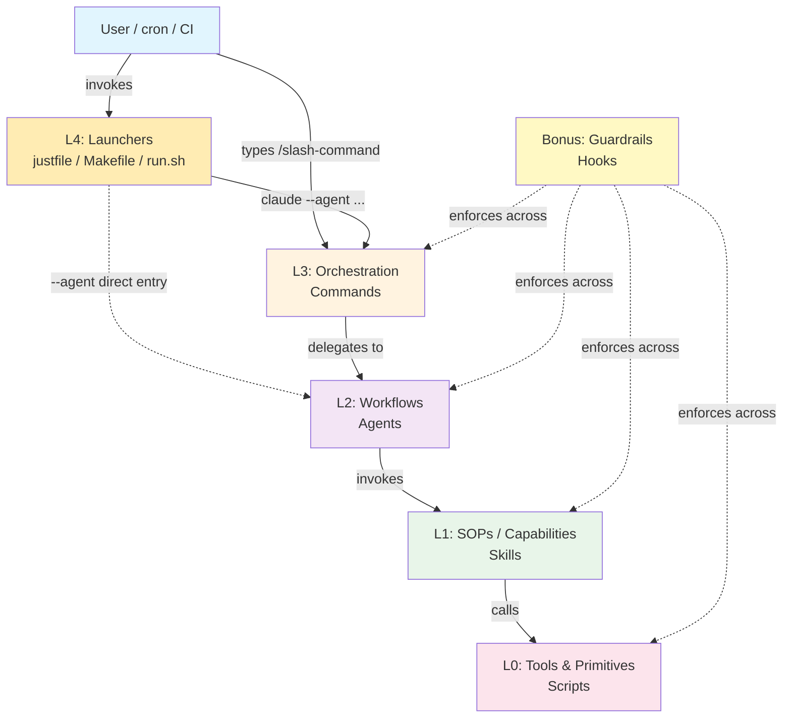
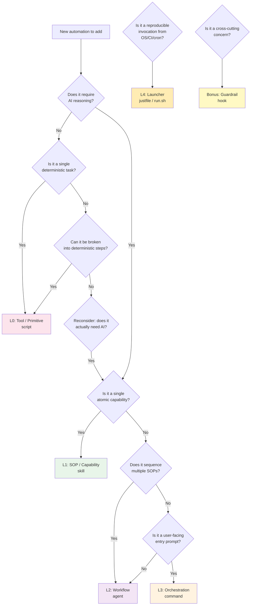

# The 4-Layer Agentic Architecture for Claude Code

## Extending Your Cognitive Horizon

Most developers use Claude Code as a flat prompt-and-respond tool. They type instructions, get output, and move on. But there is a deeper architecture waiting to be discovered -- one that transforms Claude Code from a reactive assistant into a layered autonomous system.

Understanding this architecture is not just about using tools more effectively. It is about extending your *cognitive horizon* -- the boundary of what you can conceptualize, design, and build. Each layer you internalize expands what you consider possible. You stop thinking "How do I prompt this?" and start thinking "How do I architect this?"

This document describes the **4-layer agentic architecture pattern**, a separation-of-concerns model for organizing Claude Code automation. The pattern draws inspiration from IndyDevDan's public demonstrations of Playwright-based browser automation with Claude Code, and from David Shapiro's concept of the cognitive horizon.

Each layer is named by its **conceptual role** (Orchestration, Workflows, SOPs, …). The Claude Code primitive (Commands, Agents, Skills, …) is given as the example implementation. This makes the pattern harness-agnostic: the concepts survive a switch to another agentic tool; only the implementation artifacts change. See [docs/concepts-vs-implementation.md](concepts-vs-implementation.md) for the full mapping and a comparison against IndyDevDan's original naming.

---

## Architecture Overview

```
+----------------------------------------------------------------------+
|  Bonus  : Guardrails    (e.g. Hooks — .claude/settings.json)         |
|           Cross-cutting enforcement across all layers                |
+----------------------------------------------------------------------+
|  Layer 4: Launchers     (e.g. Justfile / Makefile / run.sh)          |
|           Management scripts that invoke `claude` with specific      |
|           flags; make the stack reproducibly callable from cron/CI.  |
+----------------------------------------------------------------------+
|  Layer 3: Orchestration (e.g. Custom Commands — .claude/commands/)   |
|           Thin orchestration wrappers — the user-facing              |
|           /slash-commands                                            |
+----------------------------------------------------------------------+
|  Layer 2: Workflows     (e.g. Custom Agents — .claude/agents/*.md)   |
|           Specialist pipelines with YAML frontmatter                 |
|           (model, tools, skills...)                                  |
+----------------------------------------------------------------------+
|  Layer 1: SOPs / Capabilities                                        |
|           (e.g. Skills — .claude/skills/*/SKILL.md)                  |
|           Standard Operating Procedures — atomic, reusable           |
|           capabilities with optional bundled L0 tools                |
+----------------------------------------------------------------------+
|  Layer 0: Tools & Primitives  (e.g. Scripts — scripts/)              |
|           Mechanical automation — no AI, deterministic, testable     |
+----------------------------------------------------------------------+
```

Layers are numbered bottom-up: Layer 0 (Tools & Primitives) is the foundation; Layer 4 (Launchers) is the outermost invocation surface. Each layer has a clear conceptual role, a clear canonical implementation, and clear rules about what it may and may not do.

> **On the numbering.** IndyDevDan's original framing (Skills=1, Agents=2, Commands=3, Justfile=4) numbered three layers; we keep the same L1–L3 alignment and add **L0** for scripts (which Dan folds into Skills) plus **L4** for Launchers. So our L1 = his L1, our L2 = his L2, our L3 = his L3, our L4 ≈ his Justfile. Our L0 is explicit where his is implicit.

---

## Layer 0: Tools & Primitives

*Canonical implementation: Scripts (`scripts/*.sh`, `scripts/*.py`, any executable).*

### What

Plain shell scripts, Python scripts, or any executable that performs **mechanical, deterministic work**. No AI reasoning. No LLM calls. Just automation. The "below the AI" substrate.

### Where

```
scripts/
  setup.sh
  browser-install.sh
  lint-check.sh
  run-playwright.sh
```

### Why

Scripts are the bedrock of testability. They can be run independently, outside of Claude Code entirely. They can be tested in CI/CD. They can be debugged with standard tools. They give you a **deterministic foundation** that the upper layers can rely on without uncertainty.

### Design Principles

* **No AI reasoning** -- a script must never call an LLM or make decisions that require intelligence
* **Deterministic** -- given the same inputs, produce the same outputs
* **Testable standalone** -- run with `bash scripts/setup.sh` and verify the result without Claude Code
* **Single responsibility** -- one script does one thing (install browsers, run a test suite, capture a screenshot)
* **Exit codes matter** -- return 0 on success, non-zero on failure, so upper layers can react
* **Parameterized** -- accept arguments or environment variables rather than hardcoding values

### Connections to Other Layers

* L1 SOPs (Skills) invoke L0 tools as part of their documented procedures
* L2 Workflows (Agents) never call L0 tools directly — they go through L1 SOPs
* Guardrails (Hooks) may invoke L0 tools for validation or cleanup

### Example

```bash
#!/usr/bin/env bash
# scripts/setup.sh -- Install Playwright browsers
set -euo pipefail

npx playwright install --with-deps chromium
echo "Chromium installed successfully"
```

---

## Layer 1: SOPs / Capabilities

*Canonical implementation: Skills (`.claude/skills/*/SKILL.md`).*

### What

**Standard Operating Procedures** that document a reusable capability — "what Claude can do, documented as a procedure". Each SOP combines AI reasoning with deterministic L0 tools. An SOP is a self-contained unit that knows how to accomplish one specific task, defined by a `SKILL.md` file with YAML frontmatter and optionally bundling helper scripts.

In IndyDevDan's framing, Skills are "raw capability / vocabulary" — the words the agent can reach for. In our framing they are also Standard Operating Procedures — documented, parameterized, repeatable. The SKILL.md file literally is both: it *names* a capability and *documents the procedure* for exercising it.

### Where

```
.claude/skills/
  playwright-browser/
    SKILL.md
    setup.sh
    capture.sh
  code-review/
    SKILL.md
  git-commit/
    SKILL.md
```

### Why

SOPs are the **reuse layer**. When you find yourself repeating the same sequence of actions — install a tool, run it, interpret the output — that sequence becomes an SOP. SOPs encapsulate domain knowledge so that multiple workflows can leverage the same capability without duplicating logic.

### Design Principles

* **Atomic** — one SOP does one coherent thing (capture a screenshot, run a lint pass, commit code)
* **Self-contained** — all resources an SOP needs live in its directory
* **YAML frontmatter** — declares metadata: `name`, `description`, `allowed-tools`, and constraints (see [official skill docs](https://code.claude.com/docs/en/skills))
* **Commits own work** — if an SOP produces changes, it should commit them (not leave it for the workflow)
* **Naming convention** — `{domain}-{action}`: `playwright-browser`, `code-review`, `git-commit`
* **Bundled L0 tools** — any mechanical steps live as scripts in the SOP's directory, not inline in the SKILL.md

### SKILL.md Structure

```markdown
---
name: playwright-browser
description: Capture browser screenshots and run visual QA using Playwright
allowed-tools: Bash, Read, Write
---

# Playwright Browser Skill

## Setup
Run `${CLAUDE_SKILL_DIR}/scripts/setup.sh` to install Chromium via Playwright.

## Usage
1. Call `${CLAUDE_SKILL_DIR}/scripts/capture.sh <url>` to capture a screenshot
2. Read the screenshot file to perform visual analysis
3. Report findings in structured format

## Constraints
* Always install browsers before first use
* Clean up screenshot files after analysis
* Never navigate to URLs not provided by the caller
```

> **Note:** `allowed-tools` uses hyphens (not underscores). `${CLAUDE_SKILL_DIR}` resolves to the skill's directory at runtime.
> See [official skill docs](https://code.claude.com/docs/en/skills) for all frontmatter fields.

### Connections to Other Layers

* L0 Tools (scripts) provide the mechanical steps that SOPs orchestrate
* L2 Workflows (agents) invoke SOPs as building blocks in their pipelines
* L3 Orchestration (commands) never calls SOPs directly — it delegates to workflows

---

## Layer 2: Workflows

*Canonical implementation: Custom Agents (`.claude/agents/*.md`).*

### What

**Specialist pipelines** that sequence multiple SOPs to accomplish complex, multi-step goals. A workflow has a persona, a strategy, and the authority to make decisions about how to sequence its work. In Claude Code it's implemented as a Custom Agent defined in a `.md` file with YAML frontmatter specifying model, allowed tools, and behavioral constraints.

### Where

```
.claude/agents/
  browser-qa.md
  code-reviewer.md
  research-analyst.md
```

### Why

Workflows are where **judgment lives**. An L0 tool cannot decide whether a UI looks broken. An L1 SOP can capture a screenshot, but it takes an L2 workflow to look at the screenshot, compare it to expectations, decide what is wrong, and determine the next step. Workflows bring the adaptive, reasoning capability that separates AI-assisted automation from plain scripting.

### Design Principles

* **YAML frontmatter** — declares `model`, `tools`, `skills`, `memory`, and behavioral directives (see [official subagent docs](https://code.claude.com/docs/en/sub-agents))
* **Stop on error** — if an SOP fails, the workflow stops and reports rather than plowing ahead
* **Goal-oriented** — a workflow has a clear mission stated in its description
* **Delegates to SOPs** — workflows never implement low-level operations themselves; they invoke SOPs
* **Naming convention** — `{domain}-{role}`: `browser-qa`, `code-reviewer`, `research-analyst`
* **Structured output** — workflows report results in a consistent, parseable format

### Agent Definition Structure

```markdown
---
name: browser-qa
description: "Reviews web UIs for visual defects, accessibility issues, and layout problems"
tools: Read, Write, Bash, Glob, Grep
model: sonnet
skills:
  - playwright-browser
---

# Browser QA Agent

You are a QA specialist that reviews web UIs for visual defects,
accessibility issues, and layout problems.

## Workflow
1. Use the `playwright-browser` skill to capture screenshots of the target URL
2. Analyze each screenshot for visual issues
3. Check responsive breakpoints (mobile, tablet, desktop)
4. Compile a structured report of findings

## Error Handling
* If Playwright installation fails, stop and report the error
* If a URL is unreachable, note it and continue with remaining URLs
* Never silently swallow errors

## Output Format
Report findings as a markdown checklist with severity levels.
```

> **Note:** The `tools` field (not `allowed_tools`) controls subagent capabilities.
> The `skills` field preloads skill content into the subagent's context at startup.
> Model uses aliases: `sonnet`, `opus`, `haiku`, or `inherit`.
> See [official subagent docs](https://code.claude.com/docs/en/sub-agents) for all frontmatter fields.

### Connections to Other Layers

* L1 SOPs (Skills) are the building blocks workflows compose
* L3 Orchestration (Commands) invoke workflows to handle user requests
* Guardrails (Hooks) can enforce constraints on workflow behavior (e.g., preventing certain tool use)

---

## Layer 3: Orchestration

*Canonical implementation: Custom Commands (`.claude/commands/*.md`).*

### What

**Thin orchestration wrappers** that provide the user-facing `/slash-command` interface. Orchestration is the user-facing entry prompt — the thing a human types. It should do almost nothing itself: parse the user's intent, select the right workflow, and hand off control.

### Where

```
.claude/commands/
  ui-review.md
  code-review.md
  research.md
```

### Why

Orchestration exists for **ergonomics and discoverability**. It gives users a simple, memorable interface (`/ui-review`) without exposing the complexity of workflows, SOPs, and tools beneath. The menu at the restaurant — it tells you what is available, not how the kitchen works.

### Design Principles

* **Thin** — 5 to 15 lines maximum; if a command is longer, logic belongs in a workflow or SOP
* **No business logic** — a command delegates immediately to a workflow; it never implements the workflow itself
* **User-facing language** — written from the user's perspective, using natural language
* **Naming convention** — `{domain}-{action}`: `ui-review`, `code-review`, `research`
* **Parameterized** — accept `$ARGUMENTS` from the user to pass context to the workflow

### Command Structure

```markdown
# UI Review

Review the UI at the specified URL for visual defects and accessibility issues.

Use the `browser-qa` agent to:
1. Capture screenshots at multiple viewport sizes
2. Analyze for visual defects, layout issues, and accessibility problems
3. Generate a structured report with severity levels

Target: $ARGUMENTS
```

### Connections to Other Layers

* L2 Workflows (Agents) do the actual work that orchestration initiates
* Orchestration never calls SOPs or tools directly
* Guardrails (Hooks) may validate command inputs before execution begins

---

## Layer 4: Launchers

*Canonical implementations: `justfile`, `Makefile`, `run.sh`, Python entrypoints, shell aliases, cron jobs, CI job configs.*

### What

**Management scripts** that invoke the Claude Code binary with a specific combination of flags. Launchers are the integration surface between the OS/CI/cron world and the AI stack. They're *not* part of the AI stack itself — they're the harness that calls into it.

Dan's framing calls this "Reusability / Justfile" — "the index for everything the agent stack can do, legible to humans and callable by agents." We generalize the implementation: use whatever your team uses (justfile, make, bash, python, npm scripts). The role is what matters.

### Where

```
justfile          # just ui-review  →  runs `claude --plugin-dir ... --agent ... -p "..."`
Makefile          # make ui-review
run.sh            # ./run.sh ui-review
scripts/run_qa.py # python scripts/run_qa.py
```

### Why

Launchers exist for **reproducibility and integration**. They codify the incantation — which plugins to load, which agent to force, which settings profile to use, which permission mode, how much budget to allow, whether to run headless — so the same invocation works on your machine, a teammate's machine, a cron job, and a CI pipeline.

Without an L4 launcher, reuse relies on humans remembering the right `claude` command-line. With it, the invocation is a first-class artifact you can `git log`.

### Relevant CLI flags

Launchers typically combine some subset of these (see [CLI reference](https://docs.claude.com/en/docs/claude-code/cli-reference), also [locally cached](reference-cache/claude-code/cli-reference.md)):

| Flag | Purpose in L4 context |
|------|----------------------|
| `--plugin-dir` | Load a specific set of L1/L2/L3 artifacts for this invocation (repeatable) |
| `--agent` | Force a specific L2 workflow to be used |
| `--agents` | Define a transient L2 workflow inline as JSON |
| `--settings` / `--setting-sources` | Pick a settings profile / source scope |
| `--mcp-config` | Load MCP servers from a specific config |
| `--allowedTools` / `--disallowedTools` / `--tools` | Session-scoped tool fencing |
| `--append-system-prompt-file` | Inject extra context from a file |
| `--print` / `-p` | Non-interactive / scripted mode |
| `--bare` | Skip auto-discovery for fast scripted calls |
| `--permission-mode` | Start in `default`/`acceptEdits`/`plan`/`auto`/`dontAsk`/`bypassPermissions` |
| `--session-id` / `--resume` / `--continue` / `--fork-session` / `--name` | Session lifecycle control |
| `--max-turns` / `--max-budget-usd` | Budget caps |
| `--fallback-model` / `--model` / `--effort` | Model control |
| `--output-format` / `--input-format` / `--json-schema` | Structured I/O for pipelines |

> The docs note: *"`claude --help` does not list every flag, so a flag's absence from `--help` does not mean it is unavailable."* Refer to the [CLI reference page](https://docs.claude.com/en/docs/claude-code/cli-reference) (or the [locally cached snapshot](reference-cache/claude-code/cli-reference.md)) for the full, current list.

### Design Principles

* **Declarative** — the launcher records *what* to run, not *how* it works
* **Parameter-agnostic internals** — the launcher doesn't know about the SOP it indirectly triggers; it only knows the workflow/plugin to load
* **Reproducible** — running the same launcher target twice should yield the same stack configuration
* **Multiple implementations welcome** — you can keep a `justfile` for daily use and a CI-friendly `run.sh` side by side
* **Discoverable** — `just` with no args, `make help`, `./run.sh list` — the launcher should enumerate itself

### Example (justfile)

```makefile
# justfile — top-level launcher for the agentic stack

# Non-interactive UI review under a budget cap
ui-review url:
    claude \
        --plugin-dir ./.claude-plugins/ui-review \
        --agent browser-qa \
        --permission-mode acceptEdits \
        --max-budget-usd 0.50 \
        -p "Review the UI at {{url}}"

# Interactive session with the research stack preloaded
research topic:
    claude \
        --plugin-dir ./.claude-plugins/research \
        --agent research-analyst \
        --append-system-prompt-file ./prompts/research-style.md \
        "Research: {{topic}}"
```

### Example (bash)

```bash
#!/usr/bin/env bash
# run.sh — minimal launcher alternative to justfile
set -euo pipefail
target="${1:?Usage: run.sh <target> [args...]}"; shift
case "$target" in
  ui-review)
    exec claude --plugin-dir ./.claude-plugins/ui-review \
                --agent browser-qa --permission-mode acceptEdits \
                --max-budget-usd 0.50 -p "Review the UI at $*" ;;
  *) echo "Unknown target: $target" >&2; exit 2 ;;
esac
```

### Connections to Other Layers

* L4 Launchers invoke L3 Orchestration (or bypass L3 and go straight to L2/L1 via `--agent`, `-p`, or `--agents`)
* Launchers don't know about L0/L1 internals; they only pin which plugin set/workflow is active
* Guardrails (Hooks) still apply — `--permission-mode` and `--allowedTools` are launcher-level guardrails composable with `.claude/settings.json` hooks
* When you use the `/slash-command` at the Claude Code prompt, you are entering at L3 directly. When you call `just ui-review ...` from a shell, cron, or CI, you are entering at L4.

---

## Bonus Layer: Guardrails

*Canonical implementation: Hooks (`.claude/settings.json`, subagent frontmatter, skill frontmatter).*

### What

**Cross-cutting enforcement mechanisms** defined in `.claude/settings.json`. Hooks fire at specific lifecycle events (before/after tool use, on session start, on permission requests) and can approve, deny, or modify behavior across all layers.

### Where

```json
// .claude/settings.json (current format as of v2.1+)
{
  "hooks": {
    "PreToolUse": [
      {
        "matcher": "Bash",
        "hooks": [
          { "type": "command", "command": "python3 .claude/hooks/validate-bash.py" }
        ]
      }
    ],
    "PostToolUse": [
      {
        "matcher": "Write",
        "hooks": [
          { "type": "command", "command": "bash .claude/hooks/post-write-lint.sh" }
        ]
      }
    ]
  }
}
```

> **Note:** Hooks now use a nested format with `hooks` array and `type` field.
> Supported types: `command` (shell), `http` (HTTP endpoint), `prompt` (LLM).
> See [official hooks reference](https://code.claude.com/docs/en/hooks) for details.

### Why

Guardrails are the **immune system** of the architecture. They enforce rules that no individual layer should be responsible for. An SOP should not have to check whether it is allowed to run `rm -rf` — that is a cross-cutting concern handled by a hook. Guardrails provide trust boundaries, quality gates, and automatic cleanup.

### Design Principles

* **Enforcement, not logic** -- hooks validate and constrain; they do not implement features
* **Fail-safe** -- a hook that fails should block the action, not silently pass
* **Minimal** -- hooks should be fast and focused; heavy logic belongs in scripts
* **Cross-cutting** -- hooks apply across all layers; they are not owned by any single agent or skill

### Hook Lifecycle Events

See [official hooks reference](https://code.claude.com/docs/en/hooks) for full details and JSON schemas.

**Tool lifecycle:**

* `PreToolUse` -- fires *before* a tool executes; can block, allow, or modify the call
* `PostToolUse` -- fires *after* a tool succeeds; can trigger follow-up actions
* `PostToolUseFailure` -- fires when a tool call fails

**Agent lifecycle:**

* `SubagentStart` -- fires when a subagent begins execution (matcher: agent type name)
* `SubagentStop` -- fires when a subagent completes (matcher: agent type name)

**Session lifecycle:**

* `SessionStart` -- fires when a Claude Code session begins
* `SessionEnd` -- fires when a session ends

**User interaction:**

* `UserPromptSubmit` -- fires when the user submits a prompt
* `PermissionRequest` -- fires when a tool requests elevated permissions

**Other events:**

* `Stop` -- fires when the main agent stops execution
* `Notification` -- fires on system notifications
* `PreCompact` -- fires before context window compaction

### Connections to Other Layers

* Guardrails can block or modify behavior in any layer
* L0 Tools (scripts) are often invoked by hooks for validation logic
* Guardrails complement workflows by enforcing rules that workflows should not need to know about
* Trust hierarchy: **Hooks > Structured output > SOP instructions > Prompt**

For a deeper treatment of hooks, see [hooks-as-guardrails.md](hooks-as-guardrails.md).

---

## The Dependency Chain

The layers form a strict dependency chain. Upper layers depend on lower layers, never the reverse.



### Dependency Decision Tree

When you have a new piece of automation to add, use this decision tree to determine which layer it belongs in:



---

## Naming Conventions

All artifacts across all layers follow the `{domain}-{action}` pattern:

| Layer | Role | Example Name | File Path |
|-------|------|-------------|-----------|
| L4 Launcher | Invocation recipe | `ui-review` | `justfile` recipe / `run.sh ui-review` |
| L3 Orchestration | /slash-command | `ui-review` | `.claude/commands/ui-review.md` |
| L2 Workflow | Specialist agent | `browser-qa` | `.claude/agents/browser-qa.md` |
| L1 SOP / Capability | Skill | `playwright-browser` | `.claude/skills/playwright-browser/SKILL.md` |
| L0 Tool / Primitive | Script | `browser-install` | `scripts/browser-install.sh` |
| Bonus Guardrail | Hook | `validate-bash` | `.claude/hooks/validate-bash.py` |

Consistency in naming creates a navigable mental map. When you see `browser-qa`, you know it is a workflow (L2). When you see `playwright-browser`, you know it is an SOP (L1). The domain prefix (`browser`, `playwright`, `ui`) groups related artifacts across layers.

---

## Anti-Patterns

### Thick Orchestration (Thick Commands)

An L3 command that contains business logic, loops, conditionals, or multi-step workflows. Commands should be 5–15 lines. If your command is doing real work, that work belongs in an L2 workflow.

```markdown
<!-- ANTI-PATTERN: Command doing too much -->
# Review UI

1. Install Playwright
2. Navigate to the URL
3. Take screenshots at 3 viewport sizes
4. Analyze each screenshot for issues
5. Write a report
6. Commit the report

Target: $ARGUMENTS
```

The fix: move steps 1-6 into an L2 workflow. The command says "use the browser-qa workflow on $ARGUMENTS."

### AI Logic in L0 Tools

A script that calls an LLM API, uses `claude` CLI, or makes decisions requiring intelligence. L0 tools are deterministic. If you need AI reasoning, you need at least an L1 SOP. (Note: L4 Launchers *do* invoke `claude` — that's their whole point — but they don't contain AI logic themselves; they just start sessions.)

```bash
# ANTI-PATTERN: Script calling an LLM
#!/usr/bin/env bash
curl -X POST https://api.anthropic.com/v1/messages \
  -d '{"prompt": "Analyze this screenshot..."}'
```

The fix: the LLM call belongs in an SOP's SKILL.md instructions, not in a bash script.

### Non-Reusable SOPs

An SOP so specific to one pipeline that no other workflow could ever use it. L1 is the **reuse layer**. If an SOP can only serve one workflow, consider whether it should be inlined into that workflow or generalized.

### Workflows That Skip SOPs

A workflow that directly runs shell commands to install software, take screenshots, and parse results — doing everything itself without invoking SOPs. This creates monolithic workflows that are hard to test, hard to reuse, and hard to maintain.

### Guardrails That Implement Features

A hook that does substantial work beyond validation or enforcement. Guardrails should be lightweight gatekeepers, not feature implementations. If your hook is more than ~20 lines, the logic probably belongs in an L0 tool that the hook invokes.

### Launcher Doing Business Logic

A launcher recipe that contains loops, conditionals based on domain data, or data transformations. Launchers should record `claude` invocations, not implement workflow logic. If your `justfile` recipe reads domain files to decide what to do next, that decision belongs in an L2 workflow.

---

## Rules Summary

| Rule | Layer | Rationale |
|------|-------|-----------|
| Launchers are declarative | L4 | Keeps invocation reproducible and diffable |
| Orchestration is thin (5–15 lines) | L3 | Keeps entry prompts simple and discoverable |
| Workflows stop on error | L2 | Prevents cascading failures and silent corruption |
| SOPs commit their own work | L1 | Ensures atomic, traceable changes |
| L0 tools are testable standalone | L0 | Enables CI/CD and independent verification |
| Guardrails enforce, never implement | Bonus | Keeps cross-cutting concerns lightweight |
| No upward dependencies | All | Lower layers never import from higher layers |
| `{domain}-{action}` naming | All | Creates navigable, consistent mental map |

---

## The Full Example: UI Review

This traces the complete flow from user input to executed automation, inspired by IndyDevDan's Playwright browser automation demonstrations:

```
Launcher entry (L4):  `just ui-review https://example.com`
  → runs: claude --plugin-dir ./.claude-plugins/ui-review \
                 --agent browser-qa \
                 --permission-mode acceptEdits \
                 -p "Review the UI at https://example.com"
  (equivalent to the user typing /ui-review at the Claude Code prompt)

Orchestration (L3):  ui-review.md
  "Use the browser-qa workflow to review $ARGUMENTS"

Workflow (L2):  browser-qa.md
  1. Invoke playwright-browser SOP to capture screenshots
  2. Analyze screenshots for visual defects
  3. Check accessibility
  4. Compile and commit report

SOP / Capability (L1):  playwright-browser/SKILL.md
  1. Run setup.sh to install browsers
  2. Run capture.sh to take screenshots
  3. Return screenshot paths to workflow

Tools & Primitives (L0):  setup.sh, capture.sh
  - setup.sh: npx playwright install --with-deps chromium
  - capture.sh: npx playwright screenshot <url> output.png

Guardrails (Bonus):
  - PreToolUse(Bash): validate-bash.py blocks dangerous commands
  - PostToolUse(Write): post-write-lint.sh checks generated report
```

Each layer does exactly one kind of work. The launcher pins invocation. The orchestration is thin. The workflow reasons. The SOP sequences atomic steps. The tools execute deterministically. The guardrails enforce safety.

---

## Why This Separation Exists

The 4-layer architecture is not arbitrary bureaucracy. It solves real problems:

* **Testability** — L0 tools can be tested without AI. L1 SOPs can be tested with mocked tools. L2 workflows can be tested with mocked SOPs. L4 launchers can be dry-run. Each layer has a natural test boundary.
* **Reusability** — A `playwright-browser` SOP serves any workflow that needs browser automation, not just the QA workflow.
* **Debuggability** — When something fails, the layer tells you where to look. L0 failure? Check the bash. L1 failure? Check the SKILL.md. L2 failure? Check the workflow's reasoning. L4 failure? Check the launcher's flag combination.
* **Evolvability** — You can swap a tool without touching the SOP. You can add a new workflow without modifying existing SOPs. You can rewrite the launcher from justfile to Makefile without touching any AI artifact. Layers change independently.
* **Safety** — Guardrails provide enforcement that no single layer can bypass. The trust hierarchy ensures that safety constraints are always respected.

This is the separation of concerns principle, applied to AI-assisted automation. It is not new computer science -- it is time-tested software architecture, adapted for a world where some of your "functions" are LLM-powered reasoning engines.

Understanding this architecture does not just make you better at Claude Code. It makes you better at thinking about systems. It extends your cognitive horizon -- the set of solutions you can even imagine -- by giving you a vocabulary and a structure for thinking about AI-human automation at scale.
