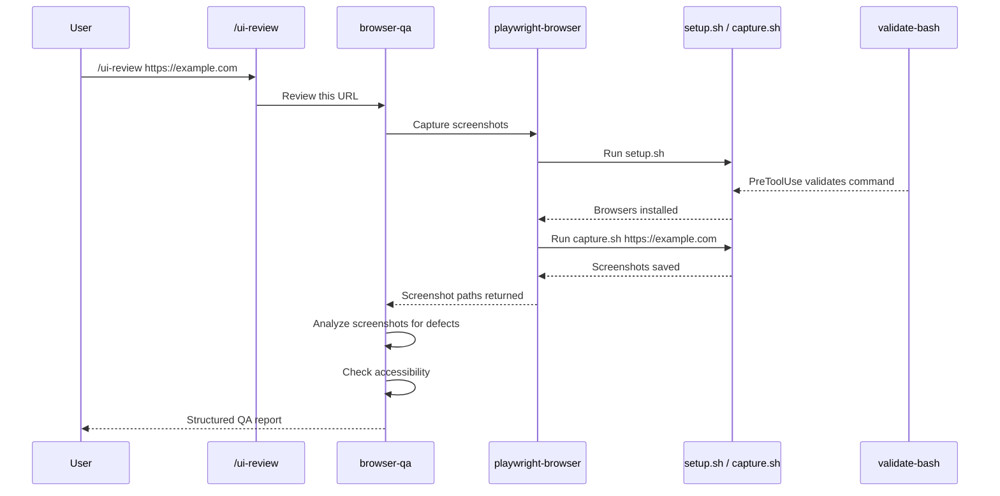

# Examples: The 4-Layer Pattern in Practice

Concrete examples showing how real workflows map to the Commands -> Agents -> Skills -> Scripts + Hooks architecture.

---

## Example 1: Playwright Browser Automation (UI Review)

Inspired by IndyDevDan's public demonstration of Playwright-based browser automation with Claude Code (see [references](references.md)).

### The User's Goal

"Review this web page for visual defects and accessibility issues."

### Layer Mapping

| Layer | Artifact | Responsibility |
|-------|----------|---------------|
| **Layer 4: Command** | `.claude/commands/ui-review.md` | Accept URL from user, delegate to agent |
| **Layer 3: Agent** | `.claude/agents/browser-qa.md` | Orchestrate screenshot capture, analyze visuals, compile report |
| **Layer 2: Skill** | `.claude/skills/playwright-browser/SKILL.md` | Atomic operation: install browsers + capture screenshots |
| **Layer 1: Scripts** | `scripts/setup.sh`, `scripts/capture.sh` | Deterministic: `npx playwright install`, `npx playwright screenshot` |
| **Bonus: Hooks** | `PreToolUse(Bash)` | Block dangerous shell commands during the workflow |

### Flow



### What Each Layer Looks Like

**Command** (`.claude/commands/ui-review.md`):

```markdown
# UI Review

Review the UI at the given URL for visual and accessibility issues.

Use the `browser-qa` agent to analyze: $ARGUMENTS
```

**Agent** (`.claude/agents/browser-qa.md`):

```markdown
---
model: claude-sonnet-4-6
allowed_tools:
  - Bash
  - Read
  - Write
---

# Browser QA Agent

You review web UIs for visual defects and accessibility.

## Workflow
1. Use the `playwright-browser` skill to capture screenshots
2. Analyze each screenshot for layout, color, typography issues
3. Check responsive behavior at mobile (375px), tablet (768px), desktop (1440px)
4. Compile findings into a severity-ranked markdown report
5. Commit the report

## On Error
Stop and report. Do not attempt workarounds.
```

**Skill** (`.claude/skills/playwright-browser/SKILL.md`):

```markdown
---
name: playwright-browser
description: Capture browser screenshots using Playwright
allowed_tools:
  - Bash
  - Read
---

# Playwright Browser Skill

## Setup
Run `./setup.sh` to install Chromium.

## Capture
Run `./capture.sh <url> <output-path>` to capture a full-page screenshot.

## Cleanup
Remove screenshot files after the agent has analyzed them.
```

**Scripts** (`scripts/setup.sh`):

```bash
#!/usr/bin/env bash
set -euo pipefail
npx playwright install --with-deps chromium
```

**Scripts** (`scripts/capture.sh`):

```bash
#!/usr/bin/env bash
set -euo pipefail
URL="${1:?Usage: capture.sh <url> [output-path]}"
OUTPUT="${2:-screenshot-$(date +%s).png}"
npx playwright screenshot --full-page "$URL" "$OUTPUT"
echo "$OUTPUT"
```

---

## Example 2: CI/CD Pipeline Review

### The User's Goal

"Review the CI/CD pipeline configuration for best practices and security issues."

### Layer Mapping

| Layer | Artifact | Responsibility |
|-------|----------|---------------|
| **Layer 4: Command** | `.claude/commands/ci-review.md` | Accept pipeline file path, delegate |
| **Layer 3: Agent** | `.claude/agents/pipeline-reviewer.md` | Analyze pipeline config, check for anti-patterns, suggest improvements |
| **Layer 2: Skill** | `.claude/skills/yaml-analyzer/SKILL.md` | Parse and validate YAML/workflow files |
| **Layer 2: Skill** | `.claude/skills/security-scanner/SKILL.md` | Check for hardcoded secrets, overly permissive permissions |
| **Layer 1: Scripts** | `scripts/yaml-lint.sh` | Run `yamllint` on config files |
| **Bonus: Hooks** | `PostToolUse(Write)` | Lint any modified pipeline files automatically |

### Flow

```
/ci-review .github/workflows/deploy.yml
  -> pipeline-reviewer agent
    -> yaml-analyzer skill (validate structure)
      -> yaml-lint.sh script (run yamllint)
    -> security-scanner skill (check secrets, permissions)
    -> Agent compiles findings into recommendations
```

### Key Insight

The **security-scanner** skill is reusable -- it can serve the CI/CD review agent, a code review agent, or a pre-commit hook. That is the power of Layer 2: skills are building blocks, not single-use modules.

---

## Example 3: Research Agent

### The User's Goal

"Research the current state of WebAssembly support in major browsers and compile a summary."

### Layer Mapping

| Layer | Artifact | Responsibility |
|-------|----------|---------------|
| **Layer 4: Command** | `.claude/commands/research.md` | Accept topic from user, delegate |
| **Layer 3: Agent** | `.claude/agents/research-analyst.md` | Plan research strategy, synthesize findings, produce report |
| **Layer 2: Skill** | `.claude/skills/web-research/SKILL.md` | Fetch and extract content from web sources |
| **Layer 2: Skill** | `.claude/skills/report-writer/SKILL.md` | Structure findings into formatted markdown |
| **Layer 1: Scripts** | `scripts/fetch-url.sh` | `curl` a URL and extract text content |
| **Bonus: Hooks** | `PreToolUse(Bash)` | Ensure no sensitive data leaks in curl commands |

### Flow

```
/research "WebAssembly browser support 2025"
  -> research-analyst agent
    -> web-research skill (fetch multiple sources)
      -> fetch-url.sh script (deterministic HTTP fetch)
    -> Agent synthesizes across sources
    -> report-writer skill (format as structured markdown)
    -> Agent commits the final report
```

### Key Insight

The agent is where **synthesis** happens. The web-research skill fetches content, but it does not decide what is important or how to combine findings. That judgment is the agent's job. This separation keeps the skill reusable and the agent focused on reasoning.

---

## Example 4: Code Review Workflow

### The User's Goal

"Review the changes in this pull request for code quality and potential bugs."

### Layer Mapping

| Layer | Artifact | Responsibility |
|-------|----------|---------------|
| **Layer 4: Command** | `.claude/commands/code-review.md` | Accept PR number or branch, delegate |
| **Layer 3: Agent** | `.claude/agents/code-reviewer.md` | Examine diffs, check patterns, provide feedback |
| **Layer 2: Skill** | `.claude/skills/diff-analyzer/SKILL.md` | Extract and parse git diffs |
| **Layer 2: Skill** | `.claude/skills/test-runner/SKILL.md` | Run test suites and report results |
| **Layer 1: Scripts** | `scripts/get-diff.sh` | `git diff` with appropriate flags |
| **Layer 1: Scripts** | `scripts/run-tests.sh` | Execute test suite, capture output |
| **Bonus: Hooks** | `PostToolUse(Write)` | Auto-lint any files the reviewer suggests modifying |

### Flow

```
/code-review feature-branch
  -> code-reviewer agent
    -> diff-analyzer skill
      -> get-diff.sh script (extract diff)
    -> Agent analyzes each changed file
    -> test-runner skill
      -> run-tests.sh script (run affected tests)
    -> Agent compiles review comments
    -> Agent posts or commits the review
```

### Key Insight

The **test-runner** skill is completely independent from code review. It can be used by a CI agent, a deployment agent, or a developer running `/test`. Skills are composable across agents -- that is the architectural payoff of keeping them atomic.

---

## Cross-Cutting: How Hooks Apply to All Examples

In every example above, hooks provide enforcement that no individual layer handles:

| Hook Event | What It Does | Which Examples |
|------------|-------------|----------------|
| `PreToolUse(Bash)` | Block dangerous shell commands (`rm -rf /`, `curl \| bash`) | All |
| `PostToolUse(Write)` | Auto-lint or validate any written file | CI Review, Code Review |
| `SessionStart` | Set up environment variables, check prerequisites | All |
| `Stop` | Clean up temporary files (screenshots, diffs) | UI Review, Research |
| `SubagentStop` | Validate subagent output format | Research (multi-source) |

Hooks are the **safety net**. They ensure that no matter which command, agent, or skill is running, the system-wide rules are enforced.

---

## Pattern Summary

Every example follows the same structural pattern:

```
User Intent -> Thin Command -> Reasoning Agent -> Atomic Skills -> Deterministic Scripts
                                                                        ^
                                                                        |
                                                    Hooks enforce rules across all layers
```

The variation is in the **domain**, not the **architecture**. Browser testing, CI/CD review, research, and code review all look different on the surface but share the same 4-layer skeleton. Once you internalize this pattern, you can design new workflows by filling in the layers rather than starting from scratch.
