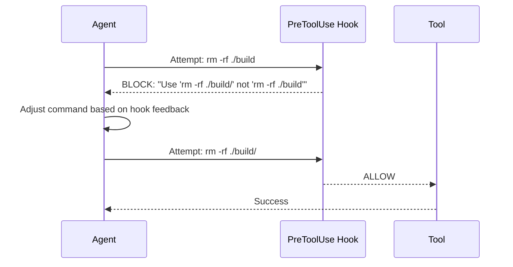
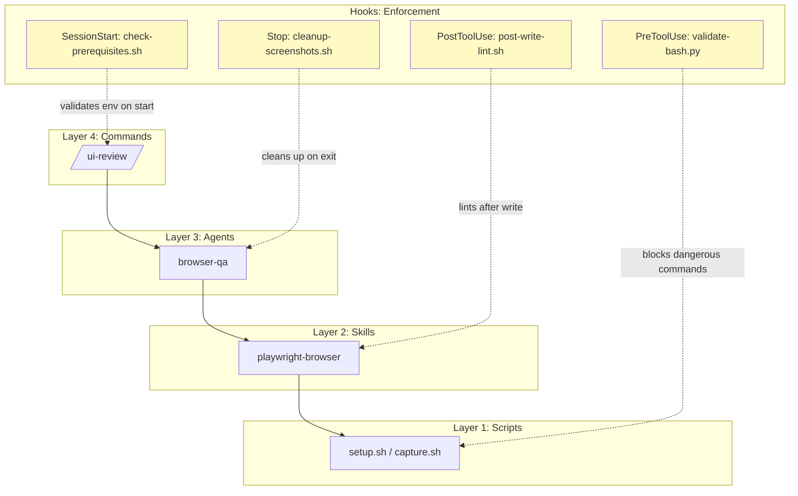

# Hooks as Guardrails: The Enforcement Layer

Hooks are the cross-cutting enforcement mechanism in the 4-layer architecture. While Commands, Agents, Skills, and Scripts handle *what* gets done, hooks enforce *how* it gets done -- and *what must never happen*.

---

## What Hooks Are

Hooks are shell commands or scripts configured in `.claude/settings.json` that fire at specific lifecycle events. They receive context as JSON on stdin and can:

* **Allow** the action (exit 0, no output)
* **Block** the action (exit 0, output JSON with `"decision": "block"`)
* **Modify** behavior (output JSON with guidance for the agent)

Hooks are not part of the 4-layer hierarchy -- they cut across all layers. They are the **immune system**, providing enforcement that no individual layer is responsible for.

---

## All Hook Lifecycle Events

Claude Code provides 12+ hook events covering the full lifecycle of a session:

### Tool Lifecycle

* **`PreToolUse`** -- Fires *before* a tool executes. Can block, allow, or modify the call.
  * Most powerful hook: prevents dangerous actions before they happen
  * Matcher targets specific tools: `Bash`, `Write`, `Read`, `Edit`, etc.

* **`PostToolUse`** -- Fires *after* a tool succeeds. Can trigger follow-up actions.
  * Quality gates: lint after write, test after edit
  * Logging and audit trails

* **`PostToolUseFailure`** -- Fires when a tool call fails.
  * Error tracking and diagnostics
  * Automatic cleanup after failed operations

### Agent Lifecycle

* **`SubagentStart`** -- Fires when a subagent begins execution.
  * Validate that the subagent has appropriate permissions
  * Log which agent spawned which subagent

* **`SubagentStop`** -- Fires when a subagent completes.
  * Validate output format and completeness
  * Aggregate metrics across subagent runs

### Session Lifecycle

* **`SessionStart`** -- Fires when a Claude Code session begins.
  * Check prerequisites (required tools installed, environment variables set)
  * Initialize session-specific state

* **`SessionEnd`** -- Fires when a session ends.
  * Cleanup temporary files
  * Flush logs, close connections

### User Interaction

* **`UserPromptSubmit`** -- Fires when the user submits a prompt.
  * Input validation and sanitization
  * Redirect or augment prompts based on context

* **`PermissionRequest`** -- Fires when a tool requests elevated permissions.
  * Custom permission policies
  * Automatic approval for trusted patterns, blocking for dangerous ones

### Other Events

* **`Stop`** -- Fires when the main agent stops execution.
  * Final cleanup: remove temp files, screenshots, intermediate artifacts
  * Generate session summary

* **`Notification`** -- Fires on system notifications.
  * Custom notification routing
  * Alert filtering

* **`PreCompact`** -- Fires before context window compaction.
  * Save critical state before context is trimmed
  * Log what is about to be compacted

---

## Hook Configuration

Hooks are defined in `.claude/settings.json`:

```json
{
  "hooks": {
    "PreToolUse": [
      {
        "matcher": "Bash",
        "command": "python3 .claude/hooks/validate-bash.py"
      },
      {
        "matcher": "Write",
        "command": "python3 .claude/hooks/validate-write-path.py"
      }
    ],
    "PostToolUse": [
      {
        "matcher": "Write",
        "command": "bash .claude/hooks/post-write-lint.sh"
      }
    ],
    "Stop": [
      {
        "command": "bash .claude/hooks/cleanup-screenshots.sh"
      }
    ],
    "SessionStart": [
      {
        "command": "bash .claude/hooks/check-prerequisites.sh"
      }
    ]
  }
}
```

### Matcher Patterns

* **Exact tool name**: `"Bash"`, `"Write"`, `"Read"`, `"Edit"`
* **No matcher**: hook fires for all tools (or for the event itself if non-tool event)
* Multiple hooks can fire for the same event -- they execute in order

---

## Example Hooks

### validate-bash.py -- Block Dangerous Shell Commands

A `PreToolUse` hook that inspects Bash commands before execution:

```python
#!/usr/bin/env python3
"""Block dangerous bash commands before execution."""
import json
import sys

BLOCKED_PATTERNS = [
    "rm -rf /",
    "rm -rf ~",
    "> /dev/sda",
    "mkfs.",
    "dd if=",
    ":(){:|:&};:",       # fork bomb
    "chmod -R 777 /",
    "curl | bash",
    "wget | bash",
]

def main():
    event = json.load(sys.stdin)
    command = event.get("tool_input", {}).get("command", "")

    for pattern in BLOCKED_PATTERNS:
        if pattern in command:
            result = {
                "decision": "block",
                "reason": f"Blocked dangerous pattern: {pattern}"
            }
            json.dump(result, sys.stdout)
            return

    # Allow by default -- no output means allow
    return

if __name__ == "__main__":
    main()
```

### post-write-lint.sh -- Auto-Lint After File Write

A `PostToolUse` hook that lints files after they are written:

```bash
#!/usr/bin/env bash
# Lint files after Write tool creates/modifies them
set -euo pipefail

EVENT=$(cat)
FILE_PATH=$(echo "$EVENT" | jq -r '.tool_input.file_path // empty')

if [[ -z "$FILE_PATH" ]]; then
  exit 0
fi

case "$FILE_PATH" in
  *.py)
    ruff check "$FILE_PATH" --fix --quiet 2>/dev/null || true
    ;;
  *.js|*.ts)
    npx eslint --fix "$FILE_PATH" 2>/dev/null || true
    ;;
  *.sh)
    shellcheck "$FILE_PATH" 2>/dev/null || true
    ;;
esac
```

### cleanup-screenshots.sh -- Session Cleanup

A `Stop` hook that removes temporary files:

```bash
#!/usr/bin/env bash
# Clean up temporary screenshots and artifacts on session end
set -euo pipefail

find . -name "screenshot-*.png" -mmin +60 -delete 2>/dev/null || true
find . -name "*.tmp" -mmin +60 -delete 2>/dev/null || true

echo "Cleanup complete"
```

### check-prerequisites.sh -- Session Start Validation

A `SessionStart` hook that verifies the environment:

```bash
#!/usr/bin/env bash
# Verify required tools are available at session start
set -euo pipefail

MISSING=()

for cmd in node npm git jq; do
  if ! command -v "$cmd" &>/dev/null; then
    MISSING+=("$cmd")
  fi
done

if [[ ${#MISSING[@]} -gt 0 ]]; then
  echo '{"decision":"block","reason":"Missing required tools: '"${MISSING[*]}"'"}'
fi
```

---

## Self-Correcting Permission Patterns

One of the most powerful hook patterns is the **self-correcting loop**: a hook blocks an action, and the agent automatically adjusts its approach.

### How It Works



### Example: Path Validation Hook

```python
#!/usr/bin/env python3
"""Enforce safe file paths -- guide agent to correct patterns."""
import json
import sys
import os

def main():
    event = json.load(sys.stdin)
    tool = event.get("tool_name", "")
    file_path = event.get("tool_input", {}).get("file_path", "")

    if not file_path:
        return

    # Block writes outside project directory
    abs_path = os.path.abspath(file_path)
    project_root = os.getcwd()

    if not abs_path.startswith(project_root):
        json.dump({
            "decision": "block",
            "reason": f"Cannot write outside project root. "
                      f"Use a path under {project_root}/ instead."
        }, sys.stdout)
        return

    # Block writes to protected paths
    protected = [".git/", "node_modules/", ".env"]
    for p in protected:
        if p in abs_path:
            json.dump({
                "decision": "block",
                "reason": f"Path '{p}' is protected. "
                          f"Choose a different location."
            }, sys.stdout)
            return

if __name__ == "__main__":
    main()
```

The agent receives the block reason and uses it to self-correct. The hook does not just say "no" -- it says "no, and here's what to do instead." This creates a feedback loop where hooks train agent behavior in real time.

---

## When Hooks Are Needed vs. When Other Layers Suffice

| Situation | Use Hook? | Alternative |
|-----------|-----------|-------------|
| Block dangerous bash commands | Yes | No alternative -- must intercept before execution |
| Lint files after writing | Yes | Could be in skill, but hook ensures it *always* happens |
| Validate agent output format | Yes (SubagentStop) | Agent instructions, but hook guarantees enforcement |
| Install a tool before use | No | Belongs in a script (Layer 1) called by a skill (Layer 2) |
| Decide which tests to run | No | Belongs in agent reasoning (Layer 3) |
| Format a report | No | Belongs in a skill (Layer 2) |
| Check if `git` is installed | Depends | SessionStart hook if it's a hard prerequisite |
| Clean up temp files | Yes (Stop) | Could be manual, but hook ensures it *always* happens |

### Rule of Thumb

Use a hook when:

* The constraint must be **universally enforced** regardless of which command/agent/skill is running
* The enforcement must happen **automatically** without relying on agent instructions
* The action needs to be **intercepted before execution** (not after)
* You need a **safety net** that catches mistakes the agent might make

Do not use a hook when:

* The logic is specific to one workflow (use a skill or agent instead)
* The operation requires AI reasoning (hooks are deterministic)
* The work is substantial enough to be its own feature (hooks should be lightweight)

---

## Trust Hierarchy

Hooks sit at the top of the trust hierarchy in Claude Code:

```
Hooks                  (highest trust -- can block anything)
  > Structured output  (tool call format constraints)
    > Skill instructions (SKILL.md behavioral rules)
      > Prompt         (lowest trust -- natural language instructions)
```

This means:

* A **hook** can override anything -- even if an agent's instructions say "always use `rm -rf`", a hook can block it
* **Structured output** constraints (like required JSON format) override natural language
* **Skill instructions** in SKILL.md carry more weight than ad-hoc prompt instructions
* **Prompt text** is the most flexible but least enforced

This hierarchy is deliberate. Safety-critical constraints should not depend on the agent "remembering" to follow a prompt instruction. They should be enforced mechanically, by hooks, where they cannot be forgotten or overridden by creative prompt interpretation.

---

## Hooks + Layers: A Complete Safety Model



Each layer does its job. Hooks make sure the jobs are done safely. Together they form a complete system where:

* **Commands** are thin and discoverable
* **Agents** reason and orchestrate
* **Skills** perform atomic operations
* **Scripts** execute deterministically
* **Hooks** enforce rules that no single layer owns

This is defense in depth for AI-assisted automation.
