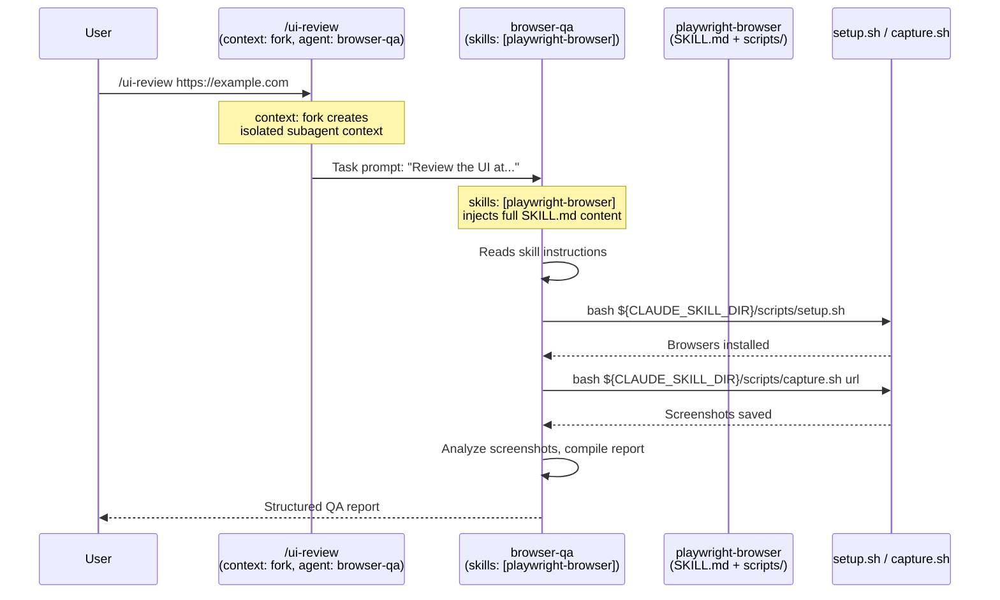

# Wiring the Chain: How Each Layer Delegates to the Next

This document explains the **exact mechanism** by which each layer of the 4-layer architecture delegates to the next, using Claude Code's official frontmatter fields. Every claim here is backed by the [official documentation](https://code.claude.com/docs/en) and verified against [real-world implementations](#real-world-examples).

---

## The Delegation Chain

```
External entry (L4 Launcher, optional):
  just ui-review https://example.com
    → claude --plugin-dir … --agent browser-qa -p "Review the UI at …"

User types (or launcher triggers): /ui-review https://example.com

  ┌──────────────────────────────────────────────────────────────┐
  │ L3 Orchestration — Command  (.claude/commands/ui-review.md)  │
  │   context: fork  +  agent: browser-qa                        │
  │   → Launches the browser-qa subagent with SOP content        │
  │     as the task prompt                                       │
  ├──────────────────────────────────────────────────────────────┤
  │ L2 Workflow — Agent  (.claude/agents/browser-qa.md)          │
  │   skills: [playwright-browser]                               │
  │   → Preloads SOP content into the workflow's context         │
  │   → Workflow reasons about what to do, follows SOP           │
  │     instructions                                             │
  ├──────────────────────────────────────────────────────────────┤
  │ L1 SOP / Capability — Skill                                  │
  │   (.claude/skills/playwright-browser/)                       │
  │   SKILL.md references ${CLAUDE_SKILL_DIR}/scripts/...        │
  │   → Workflow follows SOP instructions, runs L0 tools         │
  ├──────────────────────────────────────────────────────────────┤
  │ L0 Tools & Primitives — Scripts                              │
  │   (scripts/ or skill-bundled)                                │
  │   Deterministic shell/Python — no AI reasoning               │
  └──────────────────────────────────────────────────────────────┘
```

---

## L4 → L3: Launcher Delegates to Orchestration (or bypasses it)

**Mechanism:** An L4 launcher (justfile, Makefile, `run.sh`) invokes the `claude` binary with flags that pin the stack. Common patterns:

```makefile
# justfile
# Variant A — launch via a /slash-command (enters at L3)
ui-review-via-slash url:
    claude --plugin-dir ./.claude-plugins/ui-review -p "/ui-review {{url}}"

# Variant B — force-bind an L2 workflow directly (bypasses L3)
ui-review-direct url:
    claude --plugin-dir ./.claude-plugins/ui-review \
           --agent browser-qa \
           -p "Review the UI at {{url}}"
```

**Key flags** (see [CLI reference](https://docs.claude.com/en/docs/claude-code/cli-reference)):

| Flag | Binds which layer |
|------|-------------------|
| `--plugin-dir <path>` | The bundle of L1/L2/L3 artifacts available |
| `--agent <name>` | The L2 workflow to force (bypasses L3 if used with `-p`) |
| `--agents <json>` | Define a transient L2 workflow inline |
| `--settings <path>` / `--setting-sources` | Which L-cross settings profile applies |
| `--mcp-config <path>` | External MCP servers accessible to L0/L1 |
| `--allowedTools` / `--disallowedTools` / `--tools` | Session-scoped tool fencing |
| `--permission-mode <mode>` | Guardrail default for this invocation |
| `--max-turns <n>` / `--max-budget-usd <n>` | Budget caps |
| `-p "<prompt>"` / `--print` | Non-interactive; the prompt takes the role of the user's typed message at L3 |
| `--bare` | Skip auto-discovery for fastest scripted calls |

Launchers are the **only** layer that touches `claude` as a command-line program. Everything else lives inside a Claude Code session.

---

## L3 → L2: Orchestration (Command) Delegates to Workflow (Agent)

**Mechanism:** `context: fork` + `agent: <subagent-name>` in the command's YAML frontmatter.

```markdown
---
name: ui-review
description: "Review a web UI for visual and accessibility issues"
context: fork
agent: browser-qa
disable-model-invocation: true
---

Review the UI at the given URL: $ARGUMENTS

Capture screenshots at mobile (375px), tablet (768px), and desktop (1440px).
Report findings with severity levels.
```

**What happens:**

1. User types `/ui-review https://example.com`
2. Claude Code creates an **isolated subagent context** (`context: fork`)
3. The subagent uses the **`browser-qa`** agent definition from `.claude/agents/browser-qa.md`
4. The command's markdown body becomes the **task prompt** sent to the subagent
5. `$ARGUMENTS` is replaced with `https://example.com`

**Key fields:**

| Field | Purpose | Official docs |
|-------|---------|---------------|
| `context: fork` | Run in isolated subagent context | [Skills docs](https://code.claude.com/docs/en/skills) |
| `agent: <name>` | Which subagent definition to use | [Skills docs](https://code.claude.com/docs/en/skills) |
| `disable-model-invocation: true` | Only user can invoke this | [Skills docs](https://code.claude.com/docs/en/skills) |

> **From the official docs:** "With `context: fork`, you write the task in your skill and pick an agent type to execute it."
> — [code.claude.com/docs/en/skills](https://code.claude.com/docs/en/skills)

> **Note:** Since commands and skills have been merged in Claude Code v2.1+, a file at `.claude/commands/ui-review.md` and a skill at `.claude/skills/ui-review/SKILL.md` both create `/ui-review` and work the same way. Commands are skills with thin orchestration content.

---

## L2 → L1: Workflow (Agent) Preloads SOP (Skill)

**Mechanism:** `skills: [skill-name]` in the subagent's YAML frontmatter.

```markdown
---
name: browser-qa
description: "Reviews web UIs for visual defects, accessibility issues, and layout problems"
tools: Read, Write, Bash, Glob, Grep
model: sonnet
skills:
  - playwright-browser
---

# Browser QA Agent

You are a QA specialist. Follow the playwright-browser skill instructions
to capture and analyze screenshots.

## Workflow
1. Use the playwright-browser skill to capture screenshots
2. Analyze each screenshot for visual defects
3. Check responsive breakpoints
4. Compile a structured report
```

**What happens:**

1. When the subagent starts, the **full content** of `playwright-browser/SKILL.md` is injected into its context
2. The subagent's markdown body becomes its **system prompt**
3. The task prompt (from the command) tells it what to do
4. The subagent uses the preloaded skill knowledge to know *how* to do it

**Key fields:**

| Field | Purpose | Official docs |
|-------|---------|---------------|
| `skills: [name]` | Preload skill content at startup | [Subagent docs](https://code.claude.com/docs/en/sub-agents) |
| `tools: ...` | Restrict which tools the subagent can use | [Subagent docs](https://code.claude.com/docs/en/sub-agents) |
| `model: sonnet` | Model alias (sonnet, opus, haiku, inherit) | [Subagent docs](https://code.claude.com/docs/en/sub-agents) |

> **From the official docs:** "The full content of each skill is injected into the subagent's context, not just made available for invocation. Subagents don't inherit skills from the parent conversation; you must list them explicitly."
> — [code.claude.com/docs/en/sub-agents](https://code.claude.com/docs/en/sub-agents)

### Additional subagent capabilities

| Field | Purpose |
|-------|---------|
| `memory: user\|project\|local` | Persistent cross-session learning |
| `hooks: { PreToolUse: [...] }` | Lifecycle hooks scoped to this subagent |
| `disallowedTools: Write, Edit` | Deny specific tools |
| `permissionMode: dontAsk` | Auto-deny permission prompts |
| `maxTurns: 20` | Limit agentic turns |
| `background: true` | Always run in background |
| `isolation: worktree` | Run in isolated git worktree |

---

## L1 → L0: SOP (Skill) References Tools (Scripts)

**Mechanism:** Skill's `SKILL.md` contains instructions that reference bundled scripts via `${CLAUDE_SKILL_DIR}`.

```markdown
---
name: playwright-browser
description: Capture browser screenshots using Playwright
allowed-tools: Bash, Read
---

# Playwright Browser Skill

## Setup
Run `${CLAUDE_SKILL_DIR}/scripts/setup.sh` to install Chromium.

## Capture
Run `${CLAUDE_SKILL_DIR}/scripts/capture.sh <url> <output-path>` for a full-page screenshot.

## Cleanup
Remove screenshot files after the agent has analyzed them.
```

**What happens:**

1. The subagent reads the skill instructions (injected via `skills:` field)
2. `${CLAUDE_SKILL_DIR}` resolves to the skill's directory at runtime
3. The subagent follows the instructions, using `Bash` to execute the referenced scripts
4. Scripts are deterministic — no AI reasoning

**Key fields:**

| Field | Purpose | Official docs |
|-------|---------|---------------|
| `allowed-tools: ...` | Tools available without permission prompt | [Skills docs](https://code.claude.com/docs/en/skills) |
| `${CLAUDE_SKILL_DIR}` | Resolves to skill directory at runtime | [Skills docs](https://code.claude.com/docs/en/skills) |

> **From the official docs:** "`${CLAUDE_SKILL_DIR}` — The directory containing the skill's SKILL.md file. Use this in bash injection commands to reference scripts or files bundled with the skill, regardless of the current working directory."
> — [code.claude.com/docs/en/skills](https://code.claude.com/docs/en/skills)

---

## The Complete Chain in One Diagram



---

## Limitations and Important Notes

### Subagents cannot spawn other subagents

This is the one hard constraint. From the official docs:

> "Subagents cannot spawn other subagents. If your workflow requires nested delegation, use Skills or chain subagents from the main conversation."
> — [code.claude.com/docs/en/sub-agents](https://code.claude.com/docs/en/sub-agents)

This means the chain terminates at **depth 2**: a skill can launch a subagent, but that subagent cannot launch another subagent. However, the subagent CAN:

* Use preloaded skills (via `skills:` field)
* Execute scripts referenced by those skills
* Use all its allowed tools

This is sufficient for the 4-layer pattern because:

* L3 Orchestration (Command/Skill) → delegates via `context: fork` + `agent`
* L2 Workflow (Agent/Subagent) → uses preloaded SOPs via `skills:` field
* L1 SOP content → references L0 tools in its instructions
* L0 Tools (Scripts) → just execute

### Two directions of skill ↔ agent wiring

The official docs describe two complementary directions:

| Approach | System prompt | Task | Also loads |
|----------|--------------|------|------------|
| Skill with `context: fork` | From agent type | SKILL.md content | CLAUDE.md |
| Subagent with `skills` field | Subagent's markdown body | Claude's delegation message | Preloaded skills + CLAUDE.md |

Both are valid. The 4-layer pattern uses **both**:

* **L3 → L2** uses `context: fork` + `agent` (orchestration skill launches workflow agent)
* **L2 → L1** uses `skills: [...]` (workflow agent preloads SOP skill)

### Historical note: commands merged into skills

As of Claude Code v2.1.3+:

> "Custom commands have been merged into skills. A file at `.claude/commands/review.md` and a skill at `.claude/skills/review/SKILL.md` both create `/review` and work the same way."
> — [code.claude.com/docs/en/skills](https://code.claude.com/docs/en/skills)

The pattern still holds conceptually. **L3 Orchestration skills (thin commands)** exist solely to orchestrate — they use `context: fork` + `agent` and contain minimal logic. **L1 SOP skills (rich skills)** contain domain knowledge and tool references. The architectural distinction is in *role*, not in file format.

---

## Real-World Examples

### IndyDevDan's `bowser` repo

[github.com/disler/bowser](https://github.com/disler/bowser) implements the 4-layer pattern with Playwright browser automation:

* **Agent** (`playwright-bowser-agent.md`): `skills: [playwright-bowser]`, `model: opus`
* **Skill** (`playwright-bowser/SKILL.md`): `allowed-tools: Bash`, references bundled scripts
* **Command** (`hop-automate.md`): Thin orchestration entry point

### IndyDevDan's `claude-code-hooks-mastery` repo

[github.com/disler/claude-code-hooks-mastery](https://github.com/disler/claude-code-hooks-mastery): Comprehensive hook system covering all 13 lifecycle events, with agents and commands demonstrating the pattern.

---

## Quick Reference: Frontmatter Fields That Wire the Chain

### L3 Orchestration — Command/Skill → `.claude/commands/*.md` or `.claude/skills/*/SKILL.md`

```yaml
---
name: my-command
description: "What this command does"
context: fork              # Run in isolated subagent context
agent: my-agent            # Which subagent to use
disable-model-invocation: true  # Manual invoke only
argument-hint: "[url]"     # Autocomplete hint
---
```

### L2 Workflow — Agent → `.claude/agents/*.md`

```yaml
---
name: my-agent
description: "When Claude should delegate to this agent"
tools: Read, Write, Bash   # Allowed tools (comma-separated)
model: sonnet              # sonnet | opus | haiku | inherit
skills:                    # Preloaded skill content
  - skill-a
  - skill-b
memory: user               # Persistent learning (user|project|local)
hooks:                     # Scoped lifecycle hooks
  PreToolUse:
    - matcher: "Bash"
      hooks:
        - type: command
          command: "./scripts/validate.sh"
---
```

### L1 SOP / Capability — Skill → `.claude/skills/*/SKILL.md`

```yaml
---
name: my-skill
description: "What this skill does"
allowed-tools: Bash, Read  # Tools without permission prompt
user-invocable: false      # Hide from / menu (background knowledge)
---

Instructions referencing ${CLAUDE_SKILL_DIR}/scripts/...
```

### Bonus Guardrails — Hooks → `.claude/settings.json`

```json
{
  "hooks": {
    "PreToolUse": [
      {
        "matcher": "Bash",
        "hooks": [
          { "type": "command", "command": "./scripts/validate-bash.py" }
        ]
      }
    ]
  }
}
```
